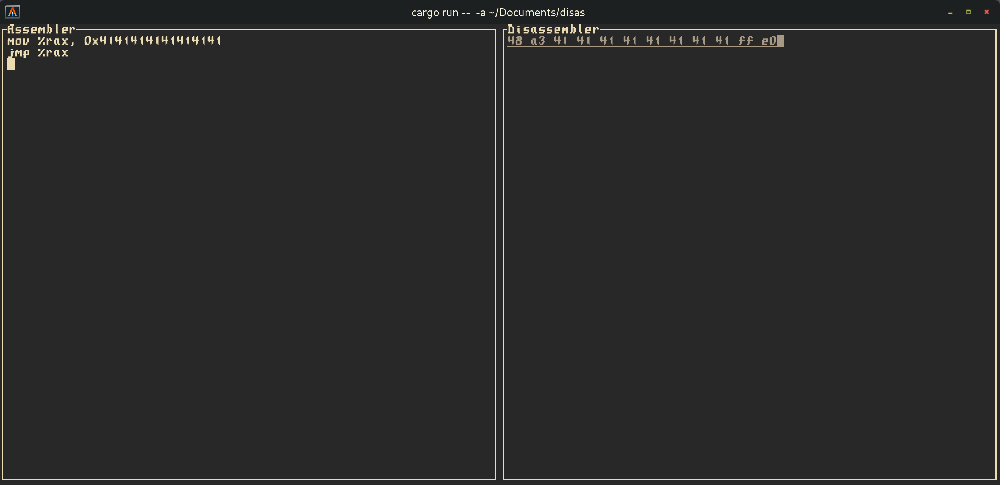

# disas

A (crappy and rushed implementation of a) TUI assembler/disassembler for easily creating shellcode.

### Screenshot


### Keybinds

| Keybind               | Action              |
|-----------------------|---------------------|
| Ctrl+Shift+Left/Right | Change active panel |
| Ctrl+Q                | Quit                |

### Arguments

```
Usage: disas [OPTIONS]

Options:
  -a, --att-syntax
      --m32
  -h, --help        Print help
```

| Argument     | Shortform | Explanation         |
|--------------|-----------|---------------------|
| --att-syntax | -a        | Enables AT&T syntax |
| --m32        |           | Enables 32 bit mode |

### Dependencies

#### Runtime dependencies
- **as**: most systems should come with the GNU assembler, if they don't: install [binutils](https://sourceware.org/binutils/) or gcc as it depends on binutils.
- **ld**: again, most systems come with the GNU linker, install binutils if you don't have it.
#### Build dependencies
- **Rust**: any somewhat recent compiler should work.

### Credits
- [Defuse.ca](https://defuse.ca/online-x86-assembler.htm) as an online version of the same application
